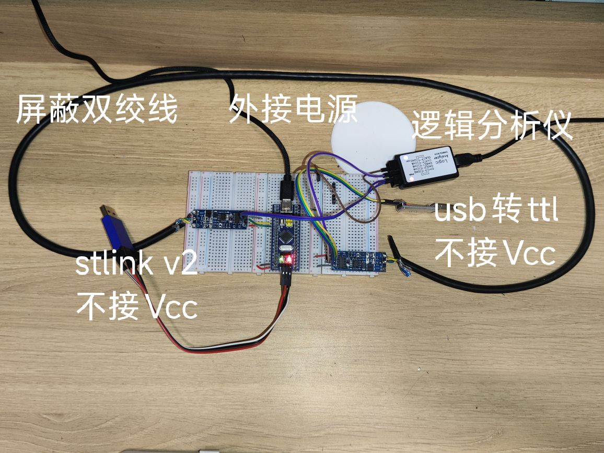
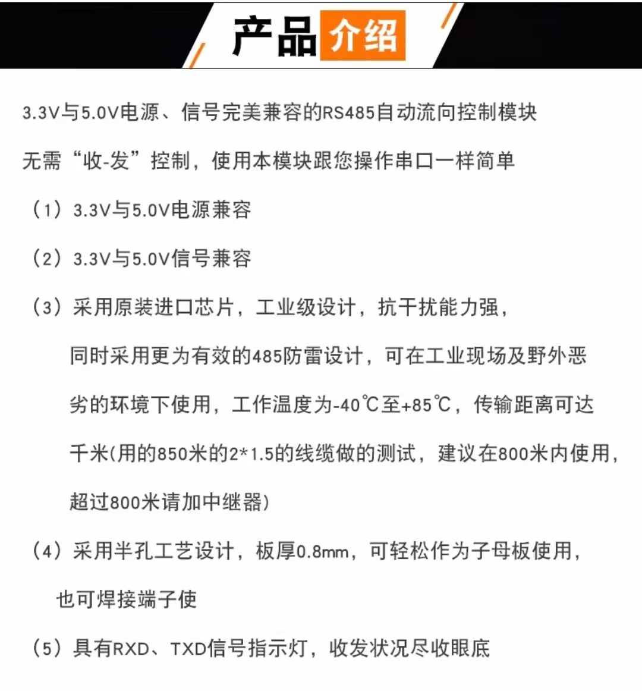
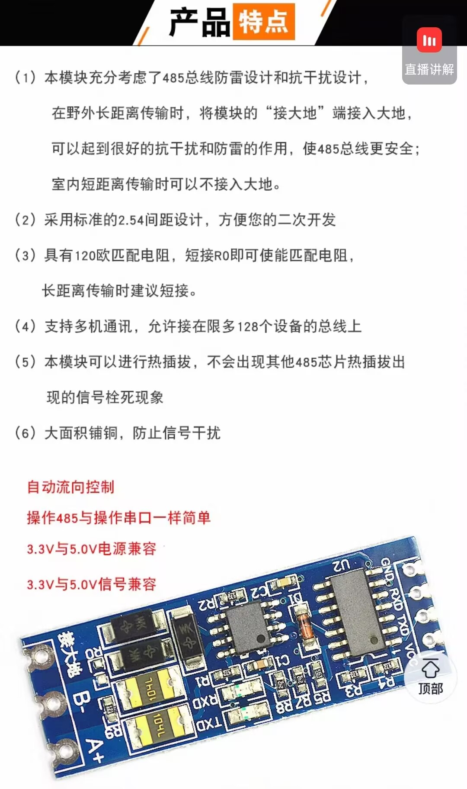

# ModbusRTU\_Gateway

基于 STM32F103C8T6 + FreeRTOS + MAX485 的 Modbus RTU 从机网关项目。当前版本聚焦于通信链路稳定性、任务生命周期管理和错误恢复能力。

## 当前实现状态

- 已实现 Modbus RTU 从机 `0x03`（读保持寄存器）
- 已实现 UART 中断接收 + 空闲帧判定 + 帧缓冲读取
- 已实现任务统一创建/停止（`System_StartTasks()` / `System_StopTasks()`）
- 已实现启动配置校验（fail-fast）和安全模式停机
- 已实现 UART 错误分级、恢复重试与日志限频

## 硬件与软件环境

- MCU：STM32F103C8T6
- 调试器：ST-LINK V2
- 收发器：TTL转RS485模块（支持3.3V工作电压）
- IDE：Keil MDK v5，VScode
- 固件库：STM32 HAL (F1)
- RTOS：FreeRTOS（CMSIS-RTOS v1 接口）

## 硬件连接与图片

### 1. 系统整体与主从硬件




### 2. TTL 转 RS485 模块说明与接线





### 3. 关键接线要点（务必检查）

- USART1：`PA9(TX)`、`PA10(RX)`
- RS485：`A/B` 极性必须与主机一致
- 电源地：主从与USB转串口必须共地
- 工业现场：建议增加板级外部上拉/终端电阻，`GPIO_PULLUP` 仅作辅助

## 目录结构

```text
ModbusRTU_Gateway/
├── Core/                 # 启动、时钟、中断、main
├── Bsp/                  # 硬件抽象层（UART/LED/KEY/EXTI）
├── App/
│   ├── Driver/           # OS 相关驱动封装（UART 互斥发送）
│   ├── Protocol/         # Modbus 协议处理
│   ├── System/           # 系统控制、错误处理、配置
│   └── Task/             # LED/UART/Monitor 任务
├── MDK-ARM/              # Keil 工程文件
└── docs/                 # 项目文档与记录
```

## 启动流程

1. `main()` 完成 `HAL_Init()` 与时钟初始化
2. 初始化 BSP 与协议：`BSP_LED_Init()`、`BSP_UART_Init()`、`Modbus_Init()`
3. `System_Ctrl_Init()` 做配置校验，失败直接 `Error_Handler()`
4. `System_StartTasks()` 创建 LED/UART/Monitor 任务
5. `osKernelStart()` 启动调度器

## 任务与配置（当前）

- `LED_Task`：500ms 翻转 LED
- `UART_Task`：周期调用 `Modbus_Process()`
- `Monitor_Task`：周期输出任务栈高水位

主要配置见 `App/System/Inc/system_config.h`：

- `LED_TASK_STACK_SIZE = 64`
- `UART_TASK_STACK_SIZE = 128`
- `MONITOR_TASK_STACK_SIZE = 256`
- `LED_TASK_PRIORITY = osPriorityLow`
- `UART_TASK_PRIORITY = osPriorityHigh`
- `MONITOR_TASK_PRIORITY = osPriorityBelowNormal`

## Modbus 通信说明

- 从机地址：`1`
- 支持功能码：`0x03`
- 寄存器数量：`MODBUS_REG_MAX_COUNT = 10`
- 接收/响应缓冲：`256` 字节

测试报文示例（读 2 个寄存器）：

```text
01 03 00 00 00 02 C4 0B
```

## 编译与下载

1. 打开工程：`MDK-ARM/ModbusRTU_Gateway.uvprojx`
2. 选择目标并编译
3. 使用 ST-LINK 下载并调试

## 调试与排障要点

- 串口错误日志格式：`ERR[类型] 文件:行号`
- 若 LED 常亮且无任务输出，优先检查是否进入 `System_EnterSafeMode()`
- 若 `ERR[2]` 高频刷屏，优先检查 UART 恢复路径是否误判 `HAL_BUSY`
- Modbus 测试请使用 HEX 模式、关闭自动换行、确认主从波特率一致
- 若图片不显示，请确认文件已放入 `docs/images/` 且文件名与 README 中一致

## 已知约束

- 目前仅实现 `0x03 功能码`，写寄存器等功能码未完整实现
- 工业干扰场景下，`GPIO_PULLUP` 仅作辅助，建议板级外部上拉/终端电阻配合

## 下一步建议

- 按实际运行数据持续回归任务栈与优先级策略
- 补全协议异常码覆盖、边界帧测试与长稳测试（24h+）

