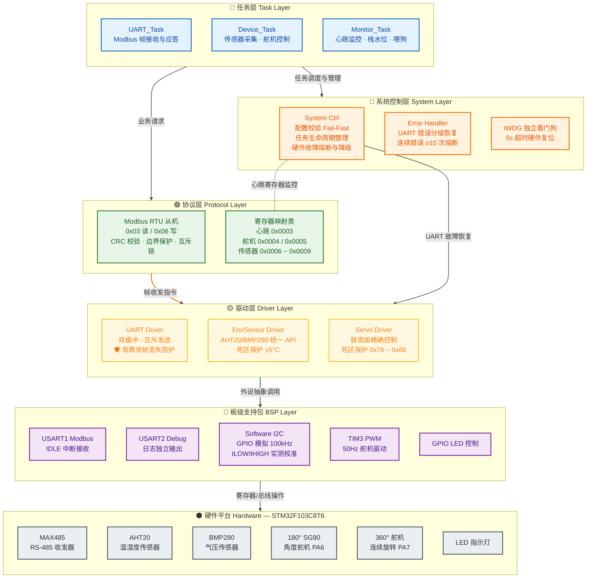
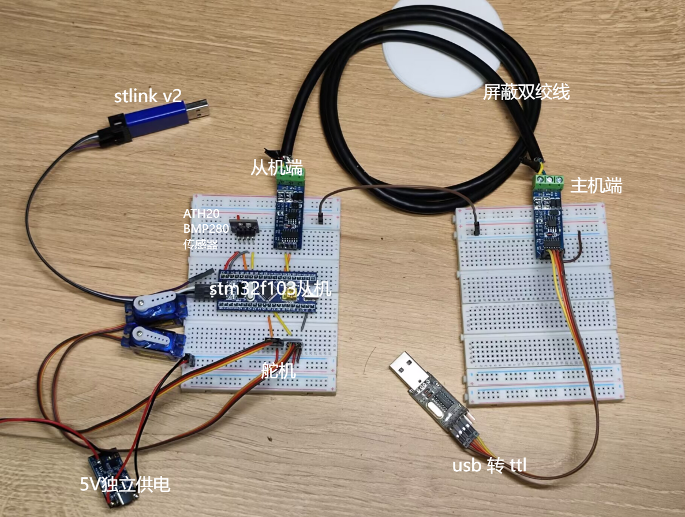

# Modbus RTU 网关（STM32F103C8T6）

**许可证**: MIT | **最近更新**: 2026-05-20  

> 基于 STM32F1 + FreeRTOS 的工业级 Modbus RTU 协议从机网关，具备高稳定性 UART 接收链、故障自恢复机制、双路异构舵机控制与系统心跳监控。

## 系统架构图


```mermaid
flowchart TD
    %% ================= 样式定义 =================
    classDef layer fill:#f9f9f9,stroke:#333,stroke-width:1px,stroke-dasharray: 5 5;
    classDef node_task fill:#e3f2fd,stroke:#1565c0,stroke-width:2px,color:#0d47a1;
    classDef node_sys fill:#fff3e0,stroke:#ef6c00,stroke-width:2px,color:#e65100;
    classDef node_proto fill:#e8f5e9,stroke:#2e7d32,stroke-width:2px,color:#1b5e20;
    classDef node_drv fill:#fff8e1,stroke:#fbc02d,stroke-width:2px,color:#f57f17;
    classDef node_bsp fill:#f3e5f5,stroke:#7b1fa2,stroke-width:2px,color:#4a148c;
    classDef node_hw fill:#eceff1,stroke:#455a64,stroke-width:2px,color:#263238;

    %% ================= 1. 任务层 =================
    subgraph task ["🔷 任务层 Task Layer"]
        direction TB
        uart_t["UART_Task<br/>Modbus 帧接收与应答"]
        dev_t["Device_Task<br/>传感器采集 · 舵机控制"]
        mon_t["Monitor_Task<br/>心跳监控 · 栈水位 · 喂狗"]
    end

    %% ================= 2. 系统控制层 =================
    subgraph system ["🔶 系统控制层 System Layer"]
        direction TB
        sys_ctrl["System Ctrl<br/>配置校验 Fail-Fast<br/>任务生命周期管理<br/>硬件故障熔断与降级"]
        err_hdl["Error Handler<br/>UART 错误分级恢复<br/>连续错误 ≥10 次熔断"]
        wdg["IWDG 独立看门狗<br/>5s 超时硬件复位"]
    end

    %% ================= 3. 协议层 =================
    subgraph protocol ["🟢 协议层 Protocol Layer"]
        direction TB
        modbus["Modbus RTU 从机<br/>0x03 读 / 0x06 写<br/>CRC 校验 · 边界保护 · 互斥锁"]
        regs["寄存器映射表<br/>心跳 0x0003<br/>舵机 0x0004 / 0x0005<br/>传感器 0x0006 ~ 0x0009"]
    end

    %% ================= 4. 驱动层 =================
    subgraph driver ["🟡 驱动层 Driver Layer"]
        direction TB
        uart_drv["UART Driver<br/>双缓冲 · 互斥发送<br/>🛡️ 背靠背帧丢失防护"]
        env_drv["EnvSensor Driver<br/>AHT20/BMP280 统一 API<br/>死区保护 ±5°C"]
        servo_drv["Servo Driver<br/>脉宽级精确控制<br/>死区保护 0x76 ~ 0x88"]
    end

    %% ================= 5. BSP 层 =================
    subgraph bsp ["🔵 板级支持包 BSP Layer"]
        direction TB
        usart1["USART1 Modbus<br/>IDLE 中断接收"]
        usart2["USART2 Debug<br/>日志独立输出"]
        i2c_sw["Software I2C<br/>GPIO 模拟 100kHz<br/>tLOW/tHIGH 实测校准"]
        tim3["TIM3 PWM<br/>50Hz 舵机驱动"]
        gpio["GPIO LED 控制"]
    end

    %% ================= 6. 硬件层 =================
    subgraph hw ["⚫ 硬件平台 Hardware — STM32F103C8T6"]
        direction TB
        max485["MAX485<br/>RS-485 收发器"]
        aht20["AHT20<br/>温湿度传感器"]
        bmp280["BMP280<br/>气压传感器"]
        sg90_a["180° SG90<br/>角度舵机 PA6"]
        sg90_b["360° 舵机<br/>连续旋转 PA7"]
        led["LED 指示灯"]
    end

    %% ================= 连线逻辑 (防交叉优化) =================
    
    %% 任务层 -> 系统层 & 协议层
    task -->|"任务调度与管理"| system
    task -->|"业务请求"| protocol

    %% 系统层 -> 协议层 (关键修改：明确起点和终点，避免交叉)
    %% "心跳监控" 走左侧路径，使用虚线区分
    sys_ctrl -.-|"心跳寄存器监控"| regs
    
    %% "故障恢复" 走中间路径去驱动层，使用粗实线
    sys_ctrl ==>|"UART 故障恢复"| driver

    %% 协议层 -> 驱动层
    protocol ==>|"帧收发指令"| driver

    %% 驱动层 -> BSP 层
    driver ==>|"外设抽象调用"| bsp

    %% BSP 层 -> 硬件层
    bsp ==>|"寄存器/总线操作"| hw

    %% ================= 样式应用 =================
    class uart_t,dev_t,mon_t node_task;
    class sys_ctrl,err_hdl,wdg node_sys;
    class modbus,regs node_proto;
    class uart_drv,env_drv,servo_drv node_drv;
    class usart1,usart2,i2c_sw,tim3,gpio node_bsp;
    class max485,aht20,bmp280,sg90_a,sg90_b,led node_hw;

    %% ================= 连线样式美化 =================
    linkStyle default stroke:#555,stroke-width:1.5px,fill:none;
    
    %% 注意：Mermaid 注释必须独占一行，不能跟在代码后
    
    %% 故障恢复连线样式 (对应第 5 条连线)
    linkStyle 4 stroke:#ef6c00,stroke-width:2px;
    
    %% 帧收发连线样式 (对应第 6 条连线)
    linkStyle 5 stroke:#2e7d32,stroke-width:2px;
```

##  技术亮点

### ✅  I2C 传感器驱动（软件模拟）

- **软件 I2C 驱动**：从零实现 GPIO 模拟 I2C，基于逻辑分析仪实测校准时序（tLOW=5.2μs，tHIGH=4.8μs），满足 100kHz 标准
- **协议分离设计**：寄存器式（BMP280）与命令式（AHT20）独立实现，统一 API 接口
- **硬件 I2C 兼容性解决**：STM32F103 硬件 I2C 与 BMP280 不兼容（误差 7.4%），改用软件 I2C 后误差降至 ≤1%
- **AHT20/BMP280 驱动**：按数据手册实现完整测量流程，支持温湿度/气压数据采集
- **环境传感器驱动封装**：提供统一的 `EnvSensor_Driver` 接口，集成故障检测、重试机制、数据有效性校验与总线恢复
- **传感器数据自动上报**：Device_Task 每 1 秒读取传感器数据，自动转换为 Modbus 寄存器格式（温度×10+1000偏移、湿度×10、气压×10）

### ✅  UART 接收链防护与调试分离

- **USART 分工**：USART1 专用于 Modbus 通信，USART2 独立输出调试日志，互不干扰
- **背靠背请求帧丢失防护**：通过空闲中断（IDLE）+ 双缓冲 + HAL 状态机同步重绑，消除奇偶交替响应故障
- **错误分级恢复机制**：ORE 立即恢复、FE/NE 连续 3 次触发恢复、PE 连续 5 次触发恢复，避免误判导致频繁重启
- **硬件故障熔断保护**：恢复重试超限（10 次）后标记硬件故障，进入系统降级运行，连续 5 帧正常后自动恢复

### ✅ 故障预警与自恢复

- **独立看门狗（IWDG）**：5 秒超时复位（LSI 40kHz / 预分频 256 / 重载值 781），修正 LSI 时钟开启与重载值计算陷阱
- **系统心跳监控**：寄存器 `0x0003` 初始值 `0x3000`，Bit 0~3 每秒翻转（`0x3000 ↔ 0x300F`），Bit 4~7 固定保留系统状态
- **栈水位监控**：周期性检测任务栈高水位（60s 间隔），低水位告警与恢复通知机制，预防栈溢出风险
- **安全模式停机**：配置校验 fail-fast，LED 编码指示 HardFault/MemManage/BusFault 等严重故障

### ✅ 协议层防护

- **协议层入参校验**：在 [Modbus_Process()](file://d:\STM32\myproject\ModbusRTU_Gateway\新建文件夹\App\modbus.h#L16-L16) 入口处校验帧长度、从机地址、CRC，非法帧直接丢弃
- **寄存器访问边界保护**：读/写请求中校验起始地址与数量组合，防止数组越界和整数溢出
- **寄存器互斥保护**：单次加锁快照读取，写回调锁外执行，避免并发一致性风险
- **日志限流机制**：错误日志按频率控制输出，避免阻塞主流程
- **默认值安全设计**：舵机寄存器默认值为非法值（0x4000与0x5000），强制主机首次写入合法值后才可控制，防止上电误动作
- **传感器数据死区保护**：AHT20 与 BMP280 温度读数差异超过 ±5°C 时自动丢弃 BMP280 数据，防止异常值污染

### ✅ 双路异构舵机控制

- **180° 舵机（SG90）**：地址 `0x0004`，通过 Modbus 写寄存器实现 0°~180° 精确角度控制（TIM3_CH1/PA6，50Hz PWM）
- **360° 连续旋转舵机**：地址 `0x0005`，通过 Modbus 写寄存器实现速度/方向控制（TIM3_CH2/PA7）
  - `0x00~0x75`：反转调速（值越小反转越快）
  - `0x76~0x88`：中位停止（死区）
  - `0x89~0xFF`：正转调速（值越大正转越快）
- **脉宽级精确控制**：BSP 层提供微秒级脉宽控制接口，消除占空比切换毛刺影响
- **死区保护机制**：固件自动过滤 0x76-0x88 范围内的写入值，强制归零至 0x7F（完全停止），避免机械磨损导致的微动抖动

### ✅ 代码工程化规范

- **硬编码数字清理**：消除全项目硬编码索引与业务阈值，22 个 Modbus 帧索引宏分组管理，18 个栈/缓冲区校验阈值提取为宏
- **注释规范化**：项目文件完成 L1-L4 分级注释（公共 API Doxygen 注释 + static 函数设计意图注释 + 物理参数单位说明）
- **代码格式化**：基于 Linux 内核风格 + MISRA 约束的 .clang-format 配置，4 空格缩进、K&R 大括号风格、100 字符列宽限制
- **日志开关解耦**：分离错误日志与监控日志的独立控制开关，生产环境可关闭周期性监控日志以减少 UART 负载

## 📊 性能指标

| 指标             | 数值                                 |
| -------------- | ---------------------------------- |
| 支持波特率          | 115200 bps                         |
| 最大帧长度          | 256 字节                             |
| 平均响应延迟         | < 1ms（典型值）                         |
| 看门狗超时          | 5 秒（LSI 40kHz / 预分频 256 / 重载值 781） |
| 内存占用           | \~10KB RAM (FreeRTOS heap)         |
| 传感器采样周期       | 1000 ms（可配置）                      |
| 传感器数据精度       | 温度 ±0.3°C，湿度 ±2%RH，气压 ±1 hPa |
| I2C 通信速率        | 100 kHz（软件模拟）                   |

## ⚙️ 技术栈
- **MCU**: STM32F103C8T6 (ARM Cortex-M3, 72MHz, 64KB Flash, 20KB RAM)
- **RTOS**: FreeRTOS v10.3.1 (CMSIS-RTOS v1 接口)
- **通信协议**: Modbus RTU over RS485 (MAX485, 自动流向控制型)
- **固件库**: STM32 HAL (F1)
- **工具链**: STM32CubeMX + Keil MDK v5 + VS Code
- **代码规范**: 注释分级规范 v2.2 + .clang-format（Linux 内核风格）

## 实物展示



## 📁 项目结构（简化）

```
ModbusRTU_Gateway/
├── App/                  # 应用层（Modbus 从机）
│   ├── Driver/           # OS 相关驱动封装（UART 互斥发送、舵机控制）
│   ├── Protocol/         # Modbus 协议处理（0x03/0x06）
│   ├── System/           # 系统控制、错误处理、配置校验
│   ├── Task/             # LED/UART/Monitor 任务
│   └── Test/             # 测试验证模块（协议层功能测试）
├── Bsp/                  # 硬件抽象层（UART/LED/软件 I2C/AHT20/BMP280/Servo）
├── Core/                 # 启动、时钟、中断、main
├── Drivers/              # HAL 库文件
├── MDK-ARM/              # Keil 工程文件
├── Middlewares/          # FreeRTOS 内核文件
├── docs/                 # 文档与记录
└── Release/              # 当前版本预编译 hex 文件
```

##  快速开始

- **[当前版本.hex文件](Release/ModbusRTU_Gateway.hex)**：预编译固件文件，直接烧录到 STM32F103C8T6

### 编译烧录
1. 打开工程：`MDK-ARM/ModbusRTU_Gateway.uvprojx`[MDK-ARM/ModbusRTU_Gateway.uvprojx](MDK-ARM/ModbusRTU_Gateway.uvprojx)
2. 选择目标并编译（确保无警告和错误）
3. 连接 ST-LINK V2，下载并调试


### 快速测试

- 硬件连接参考 [硬件接线指南](docs/硬件接线指南.md)

使用串口助手（HEX 模式，波特率 115200，8N1）发送以下指令：

``` hex
# 写 180° 舵机到 90°
01 06 00 04 00 5A 48 30 

# 读系统状态（心跳翻转）
01 03 00 03 00 01 74 0A 
```

**预期响应**：
- 写寄存器：原样回显
- 读寄存器：返回当前值（Bit 0~3 每秒翻转）

## 📄 详细文档索引

- **[硬件接线指南](docs/硬件接线指南.md)**：完整接线图、引脚定义、硬件注意事项
- **[测试指南](docs/测试指南.md)**：测试用例、串口指令、异常场景测试
- **[寄存器映射表](docs/寄存器映射表.md)**：**用户手册** - 寄存器地址表、默认值设计、读写示例、死区保护机制
- **[协议说明](docs/协议说明.md)**：**开发文档** - 帧格式规范、CRC 实现、并发一致性保证、代码实现位置


## 🎯 下一步演进方向

### 已完成功能
- ✅ Modbus RTU 从机（0x03/0x06 功能码）
- ✅ UART 接收链防护与调试日志分离
- ✅ 系统心跳与看门狗自恢复
- ✅ 双路异构SG90舵机控制（180°角度 / 360°连续旋转）
- ✅ 代码规范化（消除魔法数字、配置文件职责分离、Doxygen 注释分级、.clang-format）
- ✅ 日志开关解耦（错误日志与监控日志独立控制）
- ✅ 软件 I2C 驱动与 AHT20/BMP280 接入
- ✅ 统一传感器接口驱动层（driver_env_sensor.c）
- ✅ Monitor_Task 集成传感器数据更新 Modbus 寄存器

### 计划中功能
- [ ] 接入电位器/按键，实现本地手动控制模式
- [ ] MPU6500 角度传感器接入（PID 闭环控制）
- [ ] 扩展 Modbus 主站功能，实现双 MCU 主从架构

---

- **若有错误或不足，欢迎留言指出，我会尽快修复。**
