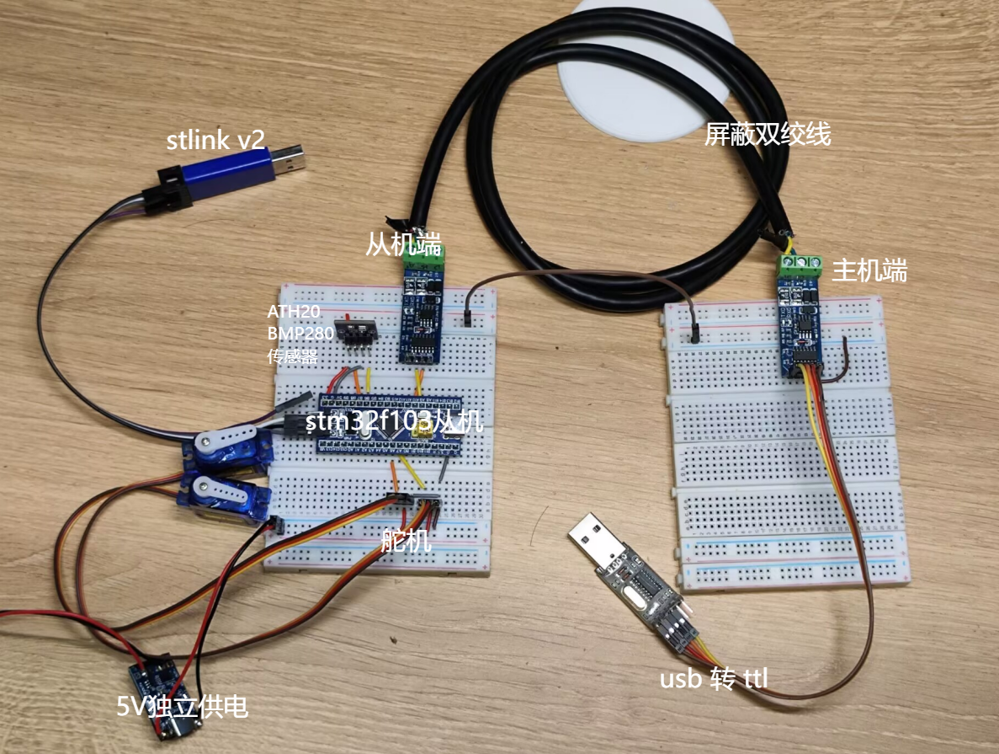
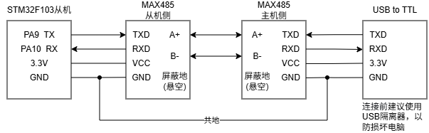
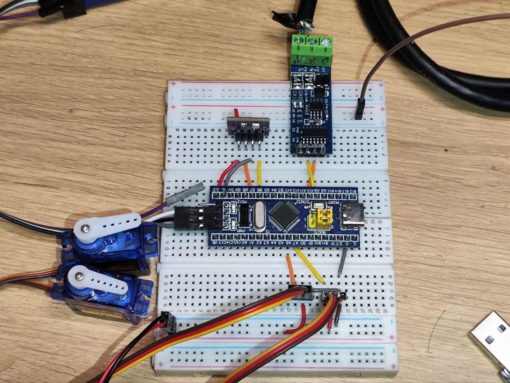
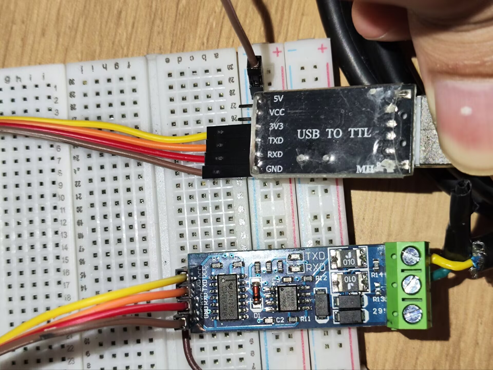
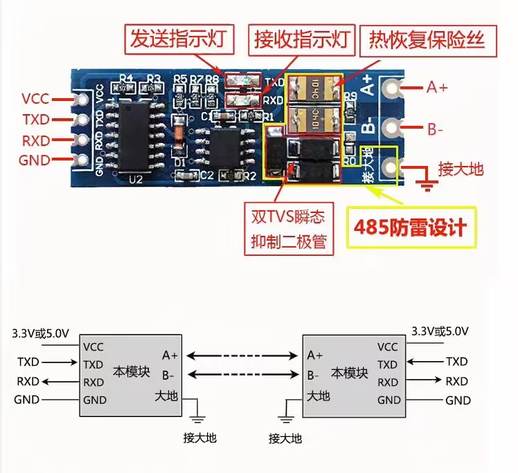
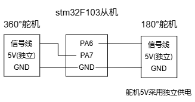
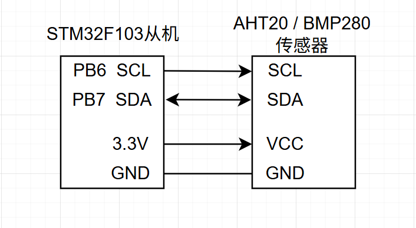
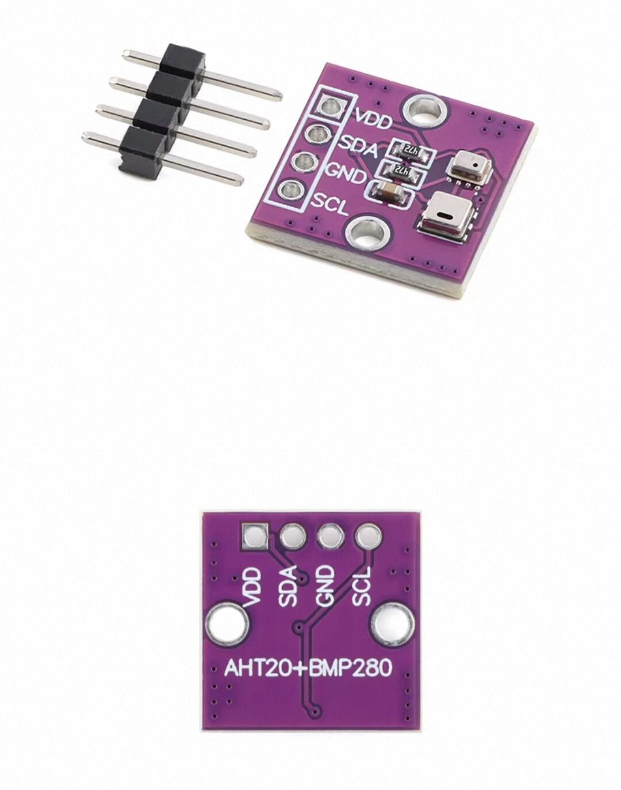

# 硬件接线指南

> **适用版本**: v1.9+ | **最后更新**: 2026-05-19  
> 本文档提供 Modbus RTU 网关的完整硬件接线图、引脚定义及注意事项，适用于项目复现与二次开发。

## 📌 系统整体架构

### 核心组件
- **MCU**: STM32F103C8T6 (ARM Cortex-M3, 72MHz)
- **RS485 模块**: MAX485 自动流向控制型（无需 MCU 控制 RE/DE）
- **舵机**: SG90 180° × 1 + SG90 360° × 1
- **电源**: 5V 独立供电（舵机）+ 3.3V（MCU）
- **传感器接口**: I2C1（PB6/PB7），预留 AHT20/BMP280 接入

---

## 🔌 RS485 通信接线

### TTL 转 RS485 模块接线表

| 模块引脚   | 连接 STM32          | 说明                |
| ------ | ----------------- | ----------------- |
| VCC    | 3.3V              | 模块电源（3.3V/5V兼容）   |
| GND    | GND               | 共地                |
| TXD    | PA9 (USART1_TX)   | 模块发送接MCU发送        |
| RXD    | PA10 (USART1_RX)  | 模块接收接MCU接收        |
| A      | A+ (主机侧)          | 485总线正极           |
| B      | B- (主机侧)          | 485总线负极           |
| 大地/屏蔽地 | （悬空）       | 接大地端，抗干扰        |

**⚠️ 重要警告**：
- ✅ **务必确保两个 MAX485 模块的 VCC 都接入 3.3V**，禁止直接连接 5V，否则有损坏 STM32 的风险
- ✅ **主机侧和从机侧 MAX485 模块的 GND 建议共地**，避免信号干扰
- ✅ **本模块为自动流向控制型**，无需 MCU 控制 RE/DE 引脚，操作与普通串口一致
- ✅ **MCU 的 UART 串口或 PC 的 USB 转 TTL 串口的 TX 连接本模块串口侧的 TXD 引脚，RX 同理**，否则无法正常通信

### MAX485模块接线图

**关键要点**：
1. ✅ **TX/RX 交叉连接**：MCU 的 TX 接模块的 TXD，RX 接 RXD（与普通串口不同）
2. ✅ **共地必须**：主从设备与 USB 转串口必须共地
3. ✅ **A/B 极性一致**：从机 A 接主机 A，B 接 B
4. ⚠️ **抗干扰建议**：工业现场增加板级外部上拉/终端电阻，`GPIO_PULLUP` 仅作辅助

### 模块实物图

---

## 🎛️ 舵机 PWM 接口（已接入）

### 引脚定义

| 引脚 | 功能 | 说明 |
|------|------|------|
| PA6 | TIM3_CH1 (180° 舵机) | 50Hz PWM，脉宽 0.5ms~2.5ms |
| PA7 | TIM3_CH2 (360° 舵机) | 50Hz PWM，脉宽 0.5ms~2.5ms |
| 5V（独立电源） | 舵机供电 | **必须独立供电，严禁与 MCU 共用 3.3V** |
| GND | 共地 | 5V 电源 GND、STM32 GND 三者必须共地 |

### 关键接线说明

| 连接类型 | 路径 | 注意事项 |
|---------|------|---------|
| **PWM 信号** | PA6/PA7 → 舵机信号线 | 杜邦线直连，长度 ≤ 15cm |
| **舵机供电** | 外部 5V 电源 → 舵机 VCC | **严禁接 MCU 3.3V** |
| **共地要求** | 外部 5V GND → STM32 GND | **必须共地，否则 PWM 无效** |

### 舵机接线示意图

### 供电警告

- ⚠️ **舵机 VCC 必须接外部 5V 电源**（如 LM2596 降压模块、5V 电池或独立电源适配器）
- ❌ **严禁接 MCU 的 3.3V 引脚**（舵机启动电流峰值 500mA~800mA，MCU 仅能提供 200mA）
- ✅ **GND 必须共地**（5V 电源 GND 与 STM32 GND 连接，否则 PWM 电平参考点不一致）

### PWM 特性

- **周期**：20ms（50Hz）
- **高电平脉宽**：0.5ms（0°）~ 2.5ms（180°）
- **中位死区**：1.5ms 对应 360° 舵机停止状态

### 180° 舵机（SG90）详细参数

| 舵机引脚 | 连接 STM32       | 说明                  |
| -------- | -------------- | --------------------- |
| VCC      | **5V 独立电源**   | ⚠️ 严禁接 MCU 3.3V！    |
| GND      | GND（与 MCU 共地） | 信号地                  |
| SIG      | PA6 (TIM3_CH1)  | PWM 信号（50Hz，2.5~12.5% 占空比） |

**功能**：通过 Modbus 写寄存器 `0x0004` 控制角度（0°~180°）

### 360° 连续旋转舵机（SG90）详细参数

| 舵机引脚 | 连接 STM32       | 说明                  |
| -------- | -------------- | --------------------- |
| VCC      | **5V 独立电源**   | ⚠️ 严禁接 MCU 3.3V！    |
| GND      | GND（与 MCU 共地） | 信号地                  |
| SIG      | PA7 (TIM3_CH2)  | PWM 信号（50Hz，2.5~12.5% 占空比） |

**功能**：通过 Modbus 写寄存器 `0x0005` 控制速度/方向（0~255）

---

## ️ 关键接线要点（务必检查）

1. **USART1**：PA9 (TX)、PA10 (RX)
2. **RS485**：A/B 极性必须与主机一致
3. **舵机供电**：**独立 5V 电源，严禁与 MCU 共用 3.3V**
4. **共地要求**：MCU、舵机、RS485、USB 转串口必须全部共地

---

## 🌡️ I2C 传感器接口（待接入）

### 引脚定义

| 引脚 | 功能 | 说明 |
|------|------|------|
| PB6 | I2C1_SCL | AHT20/BMP280 时钟线 |
| PB7 | I2C1_SDA | AHT20/BMP280 数据线 |
| 3.3V | VCC | 传感器供电（注意电平匹配） |
| GND | GND | 共地 |

### AHT20/BMP280 接线示意图

### I2C 总线特性

- **速率**：100kHz（标准模式）
- **设备地址**：
  - AHT20: `0x38`
  - BMP280: `0x76` / `0x77`（取决于 SDO 引脚）
- **挂载数量**：同一总线最多支持 2 个传感器（地址不冲突）

### 上电时序注意事项

- **AHT20**：上电后需等待 20ms 完成初始化，首次读取前发送 `0x71` 状态查询命令
- **BMP280**：上电后需等待 10ms，首次读取前配置 `oversampling` 和 `mode` 寄存器
- **总线挂载多个设备时**：确保所有传感器 VCC/GND 连接正确后再上电

### 调试建议

- 使用 I2C 扫描工具确认设备地址（STM32CubeProgrammer 或 Arduino Wire 库）
- 首次通信前检查 SCL/SDA 引脚电平（空闲时应为高电平 3.3V）
- 若读取返回 `0xFF` 或超时，检查接线极性、上拉电阻、设备地址是否正确

---

## ️ 关键接线要点（务必检查）

1. **USART1**：PA9 (TX)、PA10 (RX)
2. **RS485**：A/B 极性必须与主机一致
3. **舵机供电**：**独立 5V 电源，严禁与 MCU 共用 3.3V**
4. **共地要求**：MCU、舵机、RS485、USB 转串口必须全部共地

---

## 🔋 硬件注意事项

### 1. 电源设计
- **MCU 供电**：3.3V（由 ST-LINK 或外部 LDO 提供）
- **舵机供电**：5V 独立电源（建议使用 DC-DC 降压模块或锂电池）
- **RS485 供电**：3.3V（与 MCU 相同）
- **AHT20/BMP280 传感器供电**：3.3V
### 2. 抗干扰措施
- **RS485 总线**：使用双绞线，长度不超过 100m
- **终端电阻**：总线两端各加 120Ω 终端电阻（短距离可省略）
- **屏蔽接地**：RS485 屏蔽层单点接入屏蔽地（主机侧）

### 3. 静电防护
- RS485 A/B 线增加 TVS 二极管（如 SMBJ5.0CA）
- 舵机信号线串联 100Ω 电阻 + 并联 100pF 电容

### 4. 热设计
- 长时间运行 MCU 温升 ≤ 3℃（正常）
- 若温升 > 10℃，检查是否有短路或过载

---

## 📋 引脚汇总表

| 功能       | STM32 引脚   | 外设资源      | 备注          |
| ---------- | ------------ | ------------- | ------------- |
| RS485 TX   | PA9          | USART1_TX     |               |
| RS485 RX   | PA10         | USART1_RX     |               |
| 180° 舵机  | PA6          | TIM3_CH1      | 50Hz PWM      |
| 360° 舵机  | PA7          | TIM3_CH2      | 50Hz PWM      |
| LED        | PB12         | GPIO_Output   | 低电平亮      |
| ST-LINK    | PA13/PA14    | SWD           |               |
| I2C1_SCL   | PB6          | I2C1_SCL      | 预留传感器    |
| I2C1_SDA   | PB7          | I2C1_SDA      | 预留传感器    |

---
### AHT20/BMP280 传感器实物图

---

**返回 [README.md](../Readme.md)** | **[测试指南](测试指南.md)** | **[寄存器映射表](寄存器映射表.md)**
